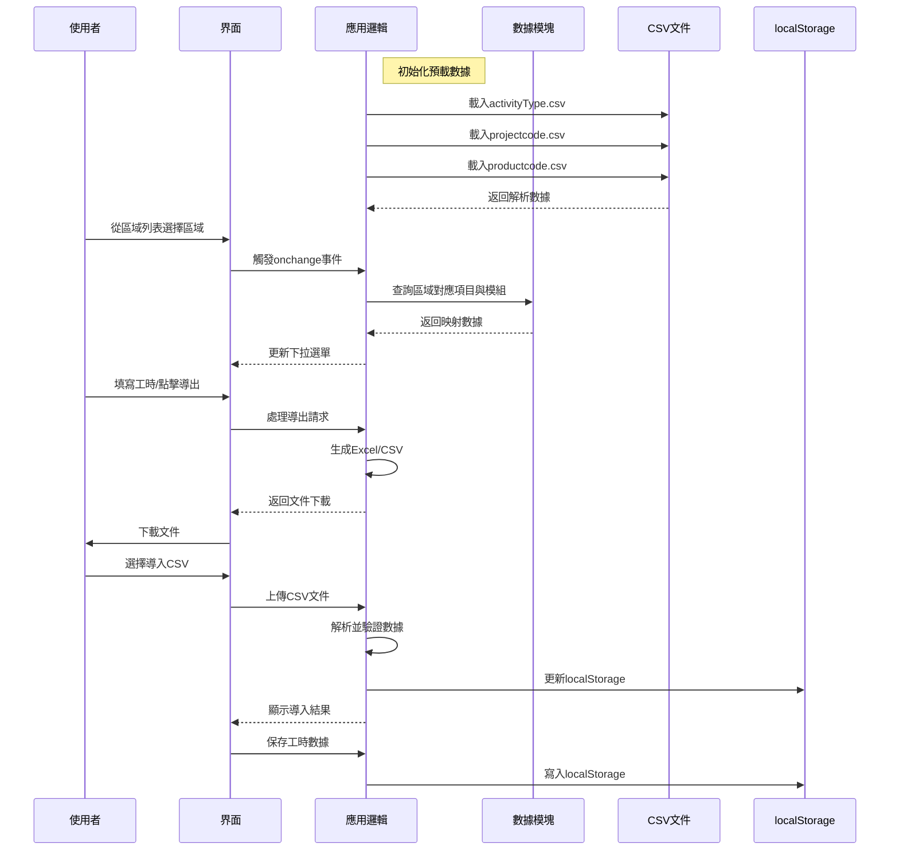
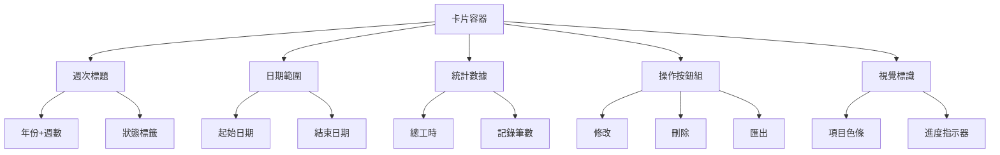
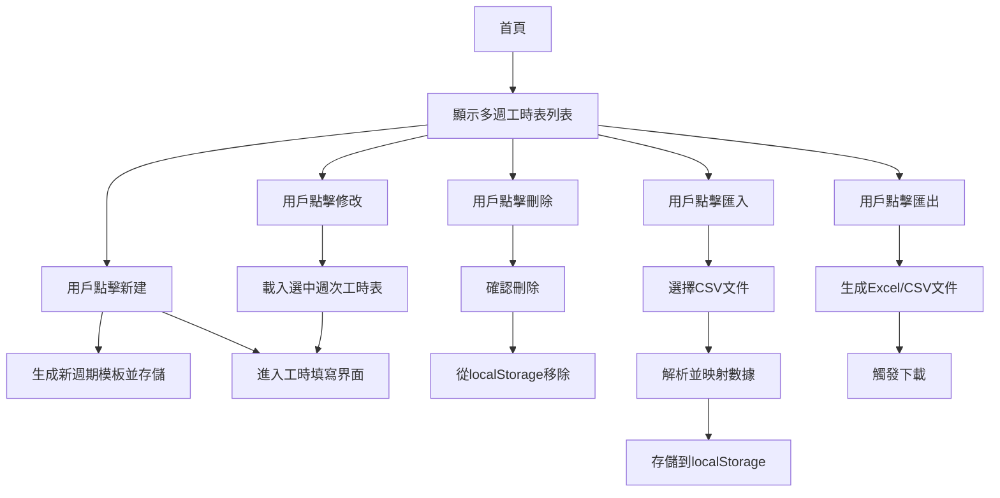

# 時間表填寫應用架構設計

## 概述
本應用旨在讓團隊成員能夠快速且準確地填寫時間表。使用者選擇區域（Zone）後，系統將自動確定對應的項目（Project）、產品模組（Product Module）以及該項目的项目经理（PM）。此外，活動（Activity）從預定義表格中選取，日期範圍限定為當週的週日至週六。

---

## 技術堆疊
- **前端技術**：HTML, CSS, JavaScript (純原生實現)
- **數據存儲**：使用瀏覽器的localStorage暫存工時數據；預定義數據從CSV動態載入
- **框架**：無核心框架依賴（使用SheetJS實現Excel導出）

---

## 文件結構
1. `index.html` - 主界面（工時表卡片列表）
2. `edit.html` - 工時細節編輯界面
3. `style.css` - 樣式表
4. `app-bundled.js` - 完整應用邏輯（單一檔案，包含所有功能）
5. `tpm-validator.html` - TPM 驗證工具儀表板
6. CSV 資料檔案：
   - `projectcode.csv` - 專案代碼資料
   - `productcode.csv` - 產品模組資料
   - `activityType.csv` - 活動類型資料

---

## 功能需求
### 1. 報表選擇
- 第一步，用戶需選擇要填寫哪一週的報表。
- 預設情況下，用戶應該填寫上周的工時。
- 如果有舊資料，幫助客戶選擇載入進行中的填寫。
- 用戶也可以選擇填寫本周的工時。
- 如果本地存在其他周的工時記錄，也一併列出。

### 2. 工時清單畫面
- 選擇周別後，進入工時清單畫面。
- 列出工時清單。
- 提供按鈕可以新增、刪除、修改某一列工時。

### 3. 工時細節畫面
- 每一笔工时会有一个细节画面，包括以下欄位：
  - Name
  - Zone
  - Project
  - Product Module
  - Activity Type
  - Task
  - Regular Hours
  - OT Hours
  - TTL_Hours
  - Date
  - Start Date
  - End Date
  - Comments
  - PM
  - InternalOrOutsource

### 4. 區域列表
- 系統支持以下區域：
  - Customer Portal
  - ERP
  - OA
  - Admin

### 5. 區域選擇聯動機制
- 當使用者從上述區域列表中選擇某一區域時，系統自動：
  - 更新 Project 下拉選單選項
  - 更新 Product Module 下拉選單選項  
  - 清空 PM 欄位（因為需要同時考量 Zone 和 Project）
- PM 欄位會根據 Zone + Project 組合自動填充對應的项目经理名字
- **重要**：PM 查找邏輯必須同時考慮 Zone 和 Project，因為不同 Zone 可能有同名專案

### 6. 活動選擇
- 活動列表從預定義表格中選取。

### 6. 添加記錄
- 客戶可以通過“加一筆”按鈕添加新的記錄，然後開始填寫工時欄位，從Zone開始。

### 7. 日期範圍
- 週工時表每週日期範圍限定為當週的週日至週六。
- 每週都是七天，不考慮跨年，加班也要考量。
- 使用完整起迄日期,不要使用ISO週數。 
- 使用JavaScript計算當前週的起始與結束日期。

### 8. GitHub集成
- 應用可以通过GitHub Pages托管，用戶可以直接通过GitHub提供的URL訪問應用。

### 9. 數據保存
- 工作數據先保存在用戶的本地存儲中（localStorage）。

### 10. 報表導出與導入
- **導出功能**：
  - 支援 CSV 格式導出（UTF-8 編碼，供 TPM 使用）
  - 正規化模式：當週總工時超過40小時時自動調整
  - 按週次分組導出
- **導入功能**：
  - 支援 CSV 格式工時數據導入
  - 自動按週次分組處理
  - 基本資訊衝突處理機制：
    - 一致數據：顯示確認對話框（繼續匯入/取消匯入）
    - 衝突數據：顯示選擇對話框（使用本地資料/使用CSV資料）
- **數據驗證**：導入時自動驗證欄位格式和必填項目

### 11. TPM 驗證工具
- **獨立驗證儀表板**：`tpm-validator.html` 提供專門的 TPM 驗證工具
- **驗證規則**：
  - Admin/Training 活動驗證：確保符合特定規則要求
  - 週總工時驗證：檢查是否在合理範圍內
  - 8小時正常工時驗證：確保符合標準工時規定
- **批次處理**：支援多個 CSV 檔案的批次驗證
- **報告生成**：提供詳細的驗證結果報告

---

## 架構圖
以下為更新後的架構示意圖：



---

## 錯誤處理機制
- **CSV加載失敗**：顯示預設數據並提示用戶
- **localStorage錯誤**：提示清理存儲空間或使用其他瀏覽器
- **導出失敗**：檢查數據格式並顯示錯誤訊息
- **導入錯誤**：
  - 文件格式不符提示重新選擇
  - 數據格式錯誤高亮顯示問題行
  - 必填欄位缺失阻止導入

## 專案狀態

### ✅ 已完成功能（100%）
1. **多週工時表列表** - 卡片式展示，完整的 CRUD 操作
2. **工時細節編輯** - 13個欄位的完整表單，驗證和自動計算
3. **CSV 數據整合** - 動態載入和聯動機制
4. **區域選擇聯動** - Zone/Project/PM 自動填充
5. **導入/導出功能** - CSV 格式，包含衝突處理
6. **TPM 驗證工具** - 獨立儀表板，多重驗證規則
7. **響應式設計** - 適配各種裝置
8. **本地儲存** - localStorage 數據持久化

### 🔄 維護階段
專案已進入維護階段，持續改進和錯誤修復。
## 多週工時表列表功能設計

### 功能描述
在首頁顯示所有已存在的工時表（按週次列出），並提供以下操作按鈕：
- 新建：創建新週期的工時表
- 修改：編輯選中的工時表（僅當該週次有本地記錄時可用）
- 刪除：刪除選中的工時表記錄
- 匯入：從CSV文件導入工時表數據
- 匯出：將選中的工時表導出為Excel或CSV格式

### 存儲結構
使用localStorage存儲多週工時表，結構如下：
```json
{
  "2023-W25": [
    { /* 工時記錄1 */ },
    { /* 工時記錄2 */ }
  ],
  "2023-W26": [ /* ... */ ]
}
```
其中，鍵為週次標識（格式：YYYY-Www），值為該週的工時記錄數組。

### 界面設計
採用卡片化佈局提升用戶體驗：

1. **整體佈局**：
   - 網格化卡片展示（每行3-4張卡片）
   - 響應式設計適配不同設備

2. **卡片內容**：
   - 週次標題（年份+週數）
   - 日期範圍（YYYY-MM-DD 至 YYYY-MM-DD）
   - 統計數據：總工時、記錄筆數
   - 操作按鈕組（修改、刪除、匯出）

3. **視覺元素**：
   - 項目色條（左側彩色標識）
   - 狀態圖標（右上角完成狀態）
   - 進度條（底部填寫進度）

4. **交互效果**：
   - 懸停：卡片提升+陰影加深
   - 點擊：淡入編輯界面
   - 刪除：滑動消失動畫

5. **全局操作**：
   - 頂部標題“多週工時表列表”
   - 頂部操作欄：“新建”和“匯入”按鈕

### 卡片化設計方案

#### 設計理念
採用卡片式佈局提升用戶體驗，每張卡片代表一週工時表，包含關鍵信息和操作入口。

#### 卡片結構


#### 設計規範
1. **尺寸與佈局**：
   - 桌面端：300px × 180px（每行3-4張卡片）
   - 移動端：100%寬度（單列展示）
   - 間距：16px

2. **視覺元素**：
   - 項目色條：左側5px寬色帶，根據項目顯示不同顏色
   - 狀態標籤：右上角標記（已完成 ✓，進行中 ⚠）
   - 進度條：底部顯示填寫完成度（0-100%）

3. **交互效果**：
   - 懸停：卡片提升+陰影加深（box-shadow: 0 4px 8px rgba(0,0,0,0.1)）
   - 點擊：淡入編輯界面（transition: opacity 0.3s）
   - 刪除：滑動消失動畫（transform: translateX(100%)）

4. **響應式設計**：
   - 使用CSS Grid實現自適應佈局
   - 斷點設計：
     - 手機：<576px (1列)
     - 平板：576-992px (2列)
     - 桌面：>992px (3-4列)

### 功能流程


### 文件修改
1. `index.html`：添加多週列表的HTML結構
2. `app.js`：實現上述功能邏輯
3. `style.css`：添加列表樣式