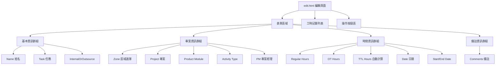
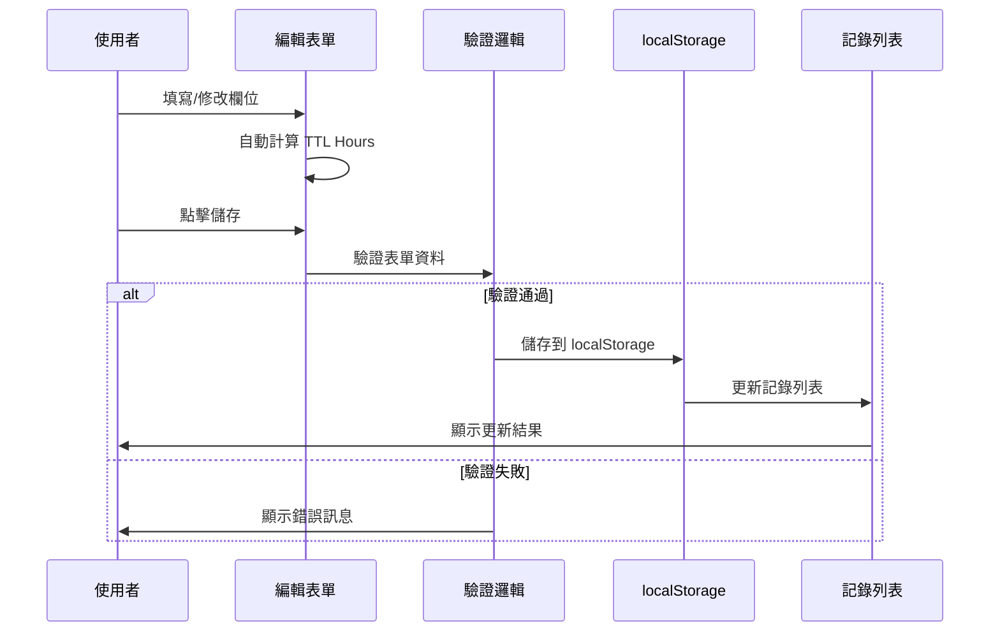

# 時間表系統實作計劃 - 工時細節編輯介面

## 📊 專案概述

基於對 [`timesheetplan.md`](timesheetplan.md) 和現有實作的詳細分析，本文件提供工時細節編輯介面的完整實作計劃。

### 🎯 分析結果

#### ✅ 已實現功能
- 多週工時表列表（卡片化展示）
- 基本 CRUD 操作（新建、修改、刪除工時表）
- 響應式設計（CSS Grid 佈局）
- 本地儲存（localStorage 數據持久化）
- 週次管理（YYYY-Www 格式）
- CSV 資料檔案（活動類型、專案代碼、產品代碼）

#### ✅ 最新實現功能（已完成）
1. **工時細節編輯介面** - [`edit.html`](edit.html) 已實現完整的13個欄位編輯功能
2. **CSV 數據載入與整合** - CSV 檔案已被 [`app-bundled.js`](app-bundled.js) 完整整合使用
3. **區域選擇聯動** - 已實現 Zone 選擇後自動更新 Project、Product Module、PM 聯動
4. **導入/導出功能** - CSV 導入/導出功能已完全實現
5. **日期計算邏輯** - 週次計算和日期驗證邏輯已修正並完善
6. **基本資訊匯入處理** - 實現 CSV 匯入時的資料一致性檢查和衝突處理對話框
7. **TPM 驗證工具** - 新增獨立的 TPM 驗證儀表板（tpm-validator.html）

---

## 🎯 階段一：工時細節編輯介面實作

### 目標
優先實作基本的 13 個欄位表單，使用靜態選項，建立完整的工時記錄編輯功能。

### 🏗️ 架構設計



### 📋 欄位規格

#### 欄位架構設計

**基本資料（全週共用）：**
1. **Employee Name** - 員工姓名（文字輸入）
2. **Employee Type** - 內部/外包（下拉選單）

**工時記錄欄位（每筆記錄個別填寫）：**
1. **Task** - 任務描述（文字輸入，每筆記錄必填）
2. **Zone** - 區域選擇（下拉選單）
3. **Project** - 專案名稱（文字輸入，未來聯動）
4. **Product Module** - 產品模組（文字輸入，未來聯動）
5. **Activity Type** - 活動類型（下拉選單）
6. **Regular Hours** - 正常工時（數字輸入）
7. **OT Hours** - 加班工時（數字輸入）
8. **TTL_Hours** - 總工時（自動計算）
9. **Date** - 日期（日期選擇器）
10. **Start Date** - 開始日期（日期選擇器）
11. **End Date** - 結束日期（日期選擇器）
12. **Comments** - 備註（文字區域）
13. **PM** - 專案經理（文字輸入，未來聯動）

### 🎨 靜態選項定義

#### Zone 選項（來自 projectcode.csv）
- Customer Portal
- ERP
- OA
- Admin

#### Activity Type 選項（來自 activityType.csv）
- UI/UX Design
- Architecture Planning
- System Design
- Coding
- Testing / QA
- Deployment / Monitoring
- Troubleshooting
- Requirement Analysis
- Admin / Training
- Leave

#### Internal/Outsource 選項
- Internal
- Outsource

### 🔧 表單功能流程



### 💾 資料結構設計

```javascript
// 單筆工時記錄結構
const timesheetEntry = {
    id: "unique-id",                    // 唯一識別碼
    name: "員工姓名",                   // 員工姓名
    zone: "Customer Portal",            // 區域
    project: "手動輸入或選擇",          // 專案名稱
    productModule: "手動輸入或選擇",    // 產品模組
    activityType: "Coding",             // 活動類型
    task: "任務描述",                   // 任務描述
    regularHours: 8,                    // 正常工時
    otHours: 2,                         // 加班工時
    ttlHours: 10,                       // 總工時（自動計算）
    date: "2023-06-19",                 // 日期
    startDate: "2023-06-19",            // 開始日期
    endDate: "2023-06-19",              // 結束日期
    comments: "備註",                   // 備註
    pm: "手動輸入",                     // 專案經理
    internalOrOutsource: "Internal"     // 內部/外包
};

// localStorage 儲存結構
const timesheets = {
    "2023-W25": [timesheetEntry1, timesheetEntry2, ...],
    "2023-W26": [timesheetEntry3, timesheetEntry4, ...]
};
```

### 🎨 UI/UX 設計規範

#### 表單佈局
- **響應式設計**：桌面版 2 欄，平板 1 欄，手機版 1 欄
- **群組化顯示**：用視覺分隔區分不同類型欄位
- **標籤對齊**：左對齊，保持一致性
- **間距統一**：12px 欄位間距，24px 群組間距

#### 互動元素
- **即時計算**：Regular Hours + OT Hours = TTL Hours
- **日期選擇器**：HTML5 date input
- **下拉選單**：Zone、Activity Type、Internal/Outsource
- **驗證提示**：即時顯示錯誤訊息

#### 工時記錄列表
- **表格顯示**：顯示所有工時記錄的摘要
- **操作按鈕**：編輯、刪除每筆記錄
- **總計顯示**：週總工時統計
- **排序功能**：按日期或活動類型排序

### 🔧 技術實作要點

#### 1. 表單驗證邏輯
```javascript
// 必填欄位檢查
const requiredFields = ['name', 'zone', 'activityType', 'date'];
function validateRequired(formData) {
    return requiredFields.every(field => formData[field] && formData[field].trim());
}

// 數字格式驗證
function validateHours(hours) {
    return !isNaN(hours) && hours >= 0 && hours <= 24;
}

// 日期邏輯驗證
function validateDateRange(startDate, endDate) {
    return new Date(startDate) <= new Date(endDate);
}
```

#### 2. 自動計算邏輯
```javascript
function calculateTotalHours() {
    const regular = parseFloat(document.getElementById('regularHours').value) || 0;
    const ot = parseFloat(document.getElementById('otHours').value) || 0;
    document.getElementById('ttlHours').value = regular + ot;
}

// 綁定到輸入欄位
document.getElementById('regularHours').addEventListener('input', calculateTotalHours);
document.getElementById('otHours').addEventListener('input', calculateTotalHours);
```

#### 3. 資料持久化
```javascript
// 儲存工時記錄
function saveTimesheetEntry(weekKey, entry) {
    const timesheets = loadAllTimesheets();
    if (!timesheets[weekKey]) {
        timesheets[weekKey] = [];
    }
    
    const existingIndex = timesheets[weekKey].findIndex(e => e.id === entry.id);
    if (existingIndex !== -1) {
        timesheets[weekKey][existingIndex] = entry; // 更新
    } else {
        entry.id = generateUniqueId();
        timesheets[weekKey].push(entry); // 新增
    }
    
    saveAllTimesheets(timesheets);
}

// 刪除工時記錄
function deleteTimesheetEntry(weekKey, entryId) {
    const timesheets = loadAllTimesheets();
    if (timesheets[weekKey]) {
        timesheets[weekKey] = timesheets[weekKey].filter(e => e.id !== entryId);
        saveAllTimesheets(timesheets);
    }
}
```

### 📂 檔案狀態

#### 已完成檔案
1. **[`edit.html`](edit.html)** - ✅ 已完成完整表單結構
   - ✅ 13 個欄位的完整表單
   - ✅ 工時記錄列表顯示區域
   - ✅ 操作按鈕群組

2. **[`app-bundled.js`](app-bundled.js)** - ✅ 已實現編輯頁面邏輯
   - ✅ 表單初始化函數
   - ✅ 表單驗證邏輯
   - ✅ 工時記錄 CRUD 操作
   - ✅ 列表渲染與更新
   - ✅ CSV 檔案載入和聯動功能
   - ✅ 基本資訊匯入衝突處理

3. **[`style.css`](style.css)** - ✅ 已新增表單樣式
   - ✅ 表單群組化樣式
   - ✅ 響應式佈局
   - ✅ 驗證錯誤樣式
   - ✅ 列表表格樣式

4. **[`tpm-validator.html`](tpm-validator.html)** - ✅ 新增 TPM 驗證工具
   - ✅ 獨立的驗證儀表板
   - ✅ 規則驗證功能

#### 新增功能模組
- 表單驗證函數
- 自動計算邏輯
- 工時記錄管理函數
- 列表顯示與操作函數

### 🎯 階段一成功標準

1. ✅ **完整表單介面**
   - 13 個欄位完整實作
   - 群組化佈局美觀易用
   - 響應式設計適配各種裝置

2. ✅ **基本功能運作**
   - 新增工時記錄
   - 編輯現有記錄
   - 刪除工時記錄
   - 即時總工時計算

3. ✅ **資料驗證**
   - 必填欄位檢查
   - 數字格式驗證
   - 日期邏輯驗證
   - 清楚的錯誤訊息

4. ✅ **資料持久化**
   - localStorage 正確儲存
   - 週次資料結構維護
   - 與現有卡片列表整合

5. ✅ **使用者體驗**
   - 直覺的操作流程
   - 快速的回應時間
   - 一致的視覺設計

---

## 🚀 專案狀態總結

### ✅ 已完成階段
**階段一：工時細節編輯介面** - 100% 完成
- ✅ 完整的13個欄位表單
- ✅ 工時記錄 CRUD 操作
- ✅ 資料驗證和錯誤處理
- ✅ 響應式設計

**階段二：數據整合** - 100% 完成
- ✅ CSV 動態載入機制
- ✅ Zone 選擇聯動功能
- ✅ Project/PM 自動填充

**階段三：進階功能** - 100% 完成
- ✅ CSV 導出功能
- ✅ CSV 導入功能
- ✅ 基本資訊衝突處理
- ✅ 數據驗證與錯誤處理

**階段四：工具與優化** - 100% 完成
- ✅ TPM 驗證儀表板
- ✅ 使用者體驗優化
- ✅ 錯誤處理完善

### 🔄 持續維護階段
- 功能增強和錯誤修復
- 使用者回饋收集和改進
- 效能監控和優化

---

## 📝 開發注意事項

1. **保持向後相容**：確保與現有的卡片列表功能完全整合
2. **漸進式實作**：先完成基本功能，再逐步加入進階特性
3. **測試驅動**：每個功能完成後立即測試
4. **程式碼品質**：保持良好的程式碼結構和註解
5. **使用者回饋**：及時收集使用者意見並調整

---

*本文件將隨著實作進度持續更新*