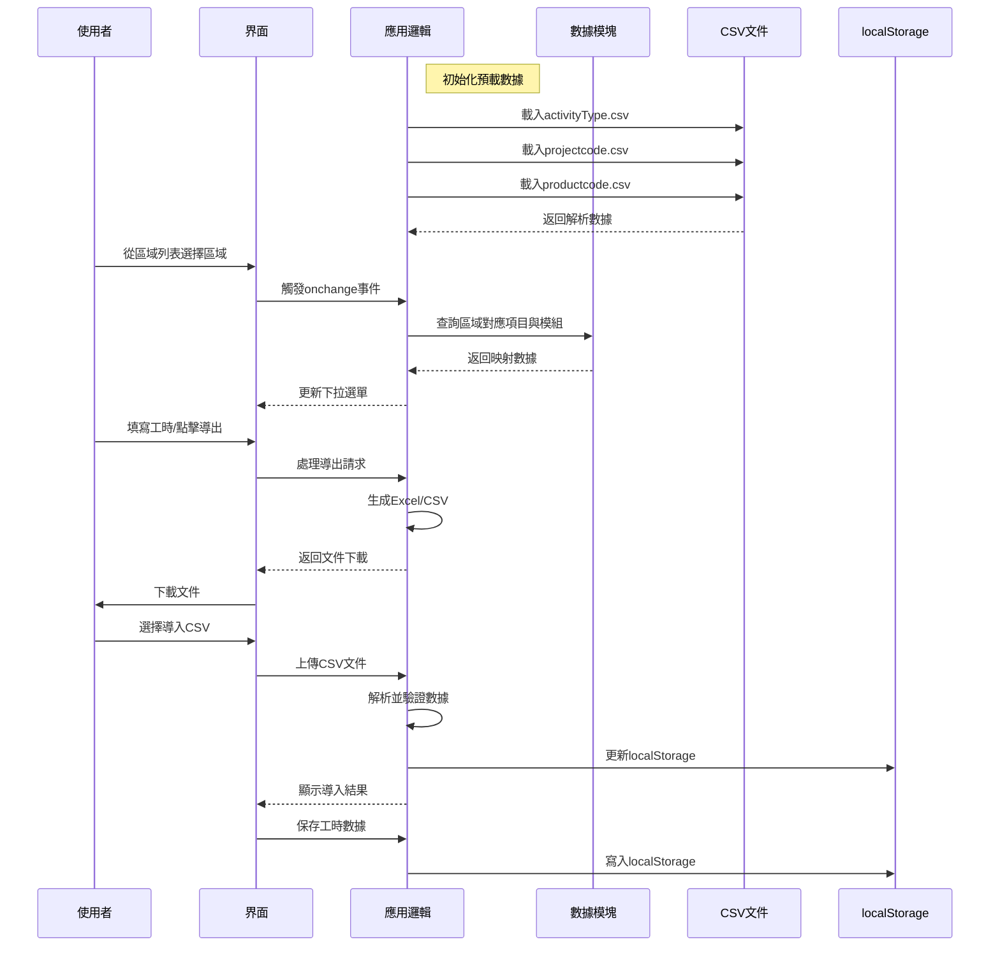
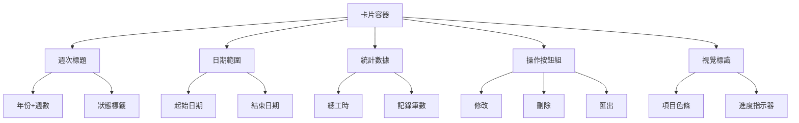
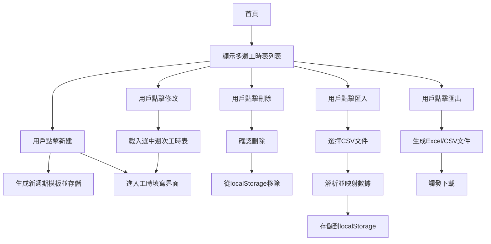

# 時間表填寫應用架構設計

## 概述
本應用旨在讓團隊成員能夠快速且準確地填寫時間表。使用者選擇區域（Zone）後，系統將自動確定對應的項目（Project）、產品模組（Product Module）以及該項目的项目经理（PM）。此外，活動（Activity）從預定義表格中選取，日期範圍限定為當週的週日至週六。

---

## 技術堆疊
- **前端技術**：HTML, CSS, JavaScript (純原生實現)
- **數據存儲**：使用瀏覽器的localStorage暫存工時數據；預定義數據從CSV動態載入
- **框架**：無核心框架依賴（使用SheetJS實現Excel導出）

---

## 文件結構
1. `index.html` - 主界面
2. `style.css` - 樣式表
3. `app.js` - 核心邏輯
4. `data.js` - 加載並解析CSV文件，提供預定義數據（區域/項目/模組/活動）

---

## 功能需求
### 1. 報表選擇
- 第一步，用戶需選擇要填寫哪一週的報表。
- 預設情況下，用戶應該填寫上周的工時。
- 如果有舊資料，幫助客戶選擇載入進行中的填寫。
- 用戶也可以選擇填寫本周的工時。
- 如果本地存在其他周的工時記錄，也一併列出。

### 2. 工時清單畫面
- 選擇周別後，進入工時清單畫面。
- 列出工時清單。
- 提供按鈕可以新增、刪除、修改某一列工時。

### 3. 工時細節畫面
- 每一笔工时会有一个细节画面，包括以下欄位：
  - Name
  - Zone
  - Project
  - Product Module
  - Activity Type
  - Task
  - Regular Hours
  - OT Hours
  - TTL_Hours
  - Date
  - Start Date
  - End Date
  - Comments
  - PM
  - InternalOrOutsource

### 4. 區域列表
- 系統支持以下區域：
  - Customer Portal
  - ERP
  - OA
  - Admin

### 5. 區域選擇
- 當使用者從上述區域列表中選擇某一區域時，系統自動填充對應的項目與產品模組。
- 包含該項目負責的项目经理（PM）的名字。

### 6. 活動選擇
- 活動列表從預定義表格中選取。

### 6. 添加記錄
- 客戶可以通過“加一筆”按鈕添加新的記錄，然後開始填寫工時欄位，從Zone開始。

### 7. 日期範圍
- 日期範圍限定為當週的週日至週六。
- 使用JavaScript計算當前週的起始與結束日期。

### 8. GitHub集成
- 應用可以通过GitHub Pages托管，用戶可以直接通过GitHub提供的URL訪問應用。

### 9. 數據保存
- 工作數據先保存在用戶的本地存儲中（localStorage）。

### 10. 報表導出與導入
- 提供雙向數據處理功能：
  - 導出：Excel(.xlsx)和CSV格式（供TPM使用）
  - 導入：支持CSV格式工時數據導入
- 實現數據映射：導入時自動匹配CSV欄位到應用欄位

### 11. 上傳/發送給TPM
- 使用者選擇特定週次後，可導出CSV格式工時表
- 使用者手動將CSV文件寄送給TPM處理

---

## 架構圖
以下為更新後的架構示意圖：



---

## 錯誤處理機制
- **CSV加載失敗**：顯示預設數據並提示用戶
- **localStorage錯誤**：提示清理存儲空間或使用其他瀏覽器
- **導出失敗**：檢查數據格式並顯示錯誤訊息
- **導入錯誤**：
  - 文件格式不符提示重新選擇
  - 數據格式錯誤高亮顯示問題行
  - 必填欄位缺失阻止導入

## 下一步
架構已根據反饋更新，請確認是否可進入開發階段。
## 多週工時表列表功能設計

### 功能描述
在首頁顯示所有已存在的工時表（按週次列出），並提供以下操作按鈕：
- 新建：創建新週期的工時表
- 修改：編輯選中的工時表（僅當該週次有本地記錄時可用）
- 刪除：刪除選中的工時表記錄
- 匯入：從CSV文件導入工時表數據
- 匯出：將選中的工時表導出為Excel或CSV格式

### 存儲結構
使用localStorage存儲多週工時表，結構如下：
```json
{
  "2023-W25": [
    { /* 工時記錄1 */ },
    { /* 工時記錄2 */ }
  ],
  "2023-W26": [ /* ... */ ]
}
```
其中，鍵為週次標識（格式：YYYY-Www），值為該週的工時記錄數組。

### 界面設計
採用卡片化佈局提升用戶體驗：

1. **整體佈局**：
   - 網格化卡片展示（每行3-4張卡片）
   - 響應式設計適配不同設備

2. **卡片內容**：
   - 週次標題（年份+週數）
   - 日期範圍（YYYY-MM-DD 至 YYYY-MM-DD）
   - 統計數據：總工時、記錄筆數
   - 操作按鈕組（修改、刪除、匯出）

3. **視覺元素**：
   - 項目色條（左側彩色標識）
   - 狀態圖標（右上角完成狀態）
   - 進度條（底部填寫進度）

4. **交互效果**：
   - 懸停：卡片提升+陰影加深
   - 點擊：淡入編輯界面
   - 刪除：滑動消失動畫

5. **全局操作**：
   - 頂部標題“多週工時表列表”
   - 頂部操作欄：“新建”和“匯入”按鈕

### 卡片化設計方案

#### 設計理念
採用卡片式佈局提升用戶體驗，每張卡片代表一週工時表，包含關鍵信息和操作入口。

#### 卡片結構


#### 設計規範
1. **尺寸與佈局**：
   - 桌面端：300px × 180px（每行3-4張卡片）
   - 移動端：100%寬度（單列展示）
   - 間距：16px

2. **視覺元素**：
   - 項目色條：左側5px寬色帶，根據項目顯示不同顏色
   - 狀態標籤：右上角標記（已完成 ✓，進行中 ⚠）
   - 進度條：底部顯示填寫完成度（0-100%）

3. **交互效果**：
   - 懸停：卡片提升+陰影加深（box-shadow: 0 4px 8px rgba(0,0,0,0.1)）
   - 點擊：淡入編輯界面（transition: opacity 0.3s）
   - 刪除：滑動消失動畫（transform: translateX(100%)）

4. **響應式設計**：
   - 使用CSS Grid實現自適應佈局
   - 斷點設計：
     - 手機：<576px (1列)
     - 平板：576-992px (2列)
     - 桌面：>992px (3-4列)

### 功能流程


### 文件修改
1. `index.html`：添加多週列表的HTML結構
2. `app.js`：實現上述功能邏輯
3. `style.css`：添加列表樣式